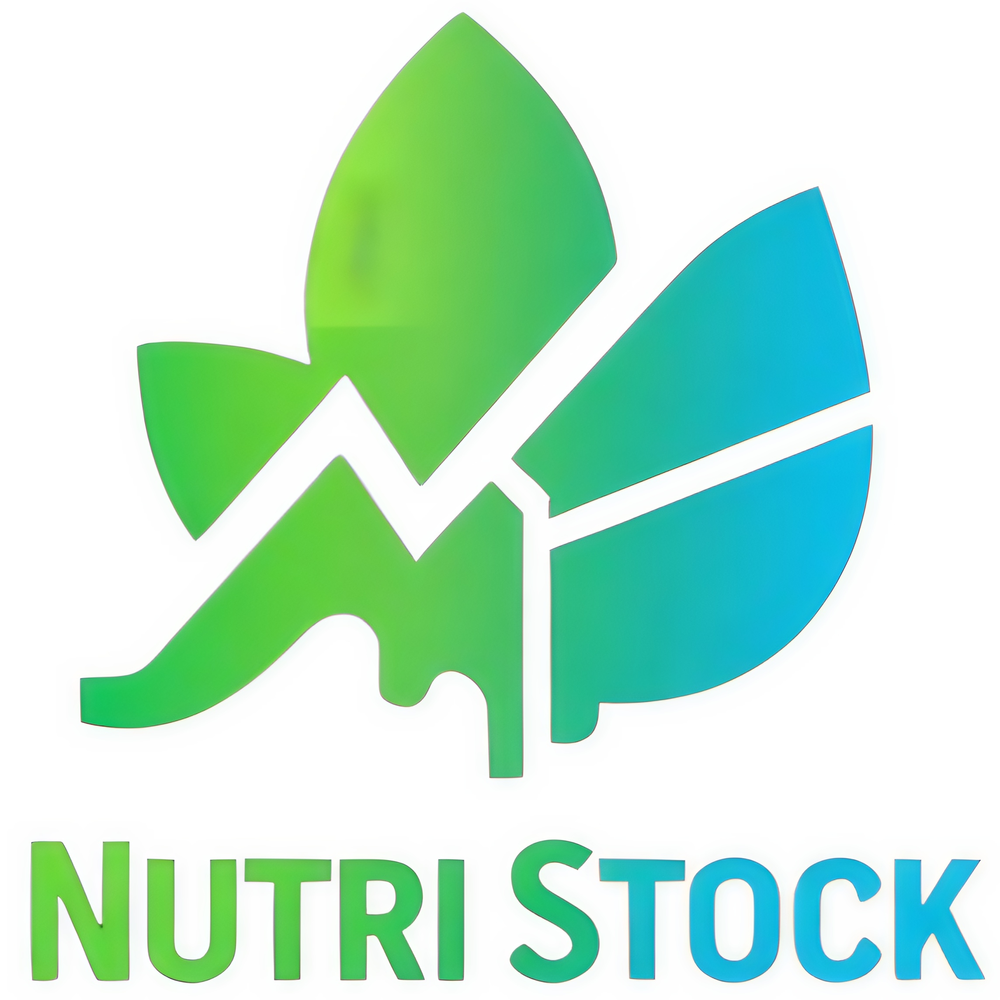

# 🥗 NutriStock - Sistema de Gestão de Estoque Nutricional

<p align="center">
  
</p>

## 📑 Índice
- [Sobre](#-sobre)
- [Funcionalidades](#-funcionalidades)
- [Tecnologias](#-tecnologias)
- [Requisitos](#-requisitos)
- [Instalação](#-instalação)
- [Configuração](#-configuração)
- [Uso](#-uso)
- [API](#-api)
- [Testes](#-testes)
- [Contribuição](#-contribuição)
- [Estrutura do Projeto](#-estrutura-do-projeto)
- [Roadmap](#-roadmap)
- [FAQ](#-faq)
- [Licença](#-licença)
- [Contato](#-contato)

## 📋 Sobre

NutriStock é um sistema de gestão de estoque desenvolvido especificamente para profissionais da área de nutrição. O sistema permite o controle eficiente de produtos alimentícios, monitoramento de validade, gestão de inventário e geração de relatórios detalhados.

## ⭐ Funcionalidades

### Principais
- Cadastro e gestão de produtos
- Controle de estoque
- Monitoramento de validade
- Gestão de fornecedores
- Relatórios personalizados
- Dashboard interativo

### Recursos Adicionais
- Sistema de alertas
- Backup automático
- Controle de acesso por níveis
- Histórico de movimentações
- Exportação de dados

## 🛠 Tecnologias

- Python 3.8+
- Flask 2.0+
- SQLAlchemy
- SQLite/PostgreSQL
- HTML5/CSS3
- JavaScript
- Bootstrap 5
- jQuery

## 📌 Requisitos

### Requisitos de Sistema
- Python 3.8 ou superior
- pip (gerenciador de pacotes Python)
- Git
- Navegador web moderno

### Dependências Principais
```
Flask==2.0.1
SQLAlchemy==1.4.23
Flask-SQLAlchemy==2.5.1
Flask-Login==0.5.0
Flask-WTF==0.15.1
Werkzeug==2.0.1
```

## 🚀 Instalação

### Clone o repositório
```
git clone https://github.com/seu-usuario/nutristock.git
cd nutristock
```

### Crie um ambiente virtual
```
python -m venv venv
Ative o ambiente virtual
```
# Windows
venv\Scripts\activate

# Linux/macOS
```
source venv/bin/activate
```

### Instale as dependências
```
pip install -r requirements.txt
```

### Configure as variáveis de ambiente
```
cp .env.example .env
```

# Edite o arquivo .env com suas configurações

## ⚙ Configuração

### Configuração do Banco de Dados
```
flask db init
flask db migrate
flask db upgrade
```

### Configuração do Ambiente

# config/development.py
DEBUG = True
SQLALCHEMY_DATABASE_URI = 'sqlite:///nutristock.db'

# config/production.py
DEBUG = False
SQLALCHEMY_DATABASE_URI = os.getenv('DATABASE_URL')

## 📱 Uso
Iniciando o Servidor
´´´
flask run
´´´

### Acessando o Sistema
Abra seu navegador
Acesse http://localhost:5000
Faça login com as credenciais padrão:
Usuário: admin@nutristock.com
Senha: admin123

## 🔌 API

### Endpoints Principais
´´´
GET /api/v1/products - Lista todos os produtos
POST /api/v1/products - Cria novo produto
GET /api/v1/products/<id> - Obtém detalhes do produto
PUT /api/v1/products/<id> - Atualiza produto
DELETE /api/v1/products/<id> - Remove produto
´´´

### Exemplos de Uso
´´´
import requests
´´´

# Listar produtos
´´´
response = requests.get('http://localhost:5000/api/v1/products')
products = response.json()
´´´

## 🧪 Testes

### Executando Testes

# Todos os testes
´´´
pytest
´´´

# Testes específicos
´´´
pytest tests/test_models.py
pytest tests/test_routes.py
´´´

# Cobertura de Testes
´´´
pytest --cov=app tests/
´´´

## 👥 Contribuição

### Fork o projeto

Crie sua Feature Branch (git checkout -b feature/AmazingFeature)
Commit suas mudanças (git commit -m 'Add some AmazingFeature')
Push para a Branch (git push origin feature/AmazingFeature)
Abra um Pull Request
Diretrizes de Contribuição
Siga o estilo de código PEP 8
Adicione testes para novas funcionalidades
Atualize a documentação conforme necessário
Mantenha o código limpo e bem documentado

## 📁 Estrutura do Projeto
´´´
nutristock/
├── app/
│   ├── models/
│   ├── routes/
│   ├── templates/
│   ├── static/
│   └── utils/
├── config/
├── tests/
├── instance/
├── requirements.txt
└── README.md
´´´

## 🗺 Roadmap
Versão 1.1
 Implementação de relatórios avançados
 Integração com sistemas externos
 App mobile
Versão 1.2
 Sistema de notificações
 Dashboard personalizado
 Análise preditiva de estoque

## ❓ FAQ
P: Como redefinir minha senha? R: Acesse a página de login e clique em "Esqueci minha senha".

P: O sistema funciona offline? R: Não, é necessário conexão com internet.

## 📄 Licença
Este projeto está licenciado sob a Licença da Uninassau - veja o arquivo LICENSE para detalhes.

## 📞 Contato
Danilo Leal - @twitter.com/@test_profile - test@protonmail.com

Link do Projeto: https://github.com/Danilo2103/NutriStock

Desenvolvido com ❤️ por Equipe do NutriStock

Para usar este README:

1. Salve o conteúdo em um arquivo chamado `README.md`
2. Substitua os placeholders (seu-usuario, Seu Nome, etc.) com suas informações
3. Adicione seu logo na pasta `app/static/images/`
4. Personalize as seções conforme necessário
5. Mantenha o arquivo atualizado conforme o projeto evolui

O arquivo usa Markdown com emojis e badges para melhor visualização. Você pode personalizar ainda mais adicionando:

- Screenshots do sistema
- Gifs demonstrativos
- Mais badges
- Mais
